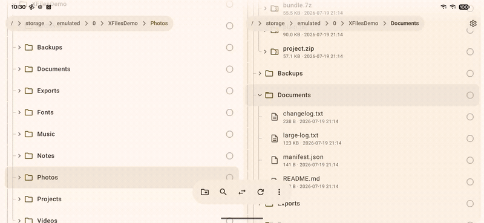

<div align="center">


# XFiles

**An offline, open-source Android file manager with X-plore's workflow** — dual-pane
tree browsing, archives as folders, an app manager, APK/AAB/XAPK install, and root &
Shizuku access, with a Material 3 Expressive UI.

[](https://github.com/Local1stDotApp/XFiles/releases)
[](LICENSE)
[-3DDC84?logo=android&logoColor=white)](#download)
[](#build)
[](#permissions--privacy)

English · [简体中文](README.zh-CN.md)



<sub>Real capture on a OnePlus 7 Pro (Android 16), sped up. One run: <b>file copy</b> → <b>App manager</b> (an app's components &amp; APK splits) → <b>Root</b> (the real filesystem, <code>/data</code> and all).</sub>

</div>

---

## Why

- **X-plore broke on [Waydroid](https://waydro.id)**, and I needed a replacement.
- **It's the LLM era** — if a tool doesn't fit, build your own.
- **An app with root powers should be open source, fully offline, and collect nothing.**
  XFiles has no `INTERNET` permission and no analytics.

## Download

Get an APK from [**Releases**](https://github.com/Local1stDotApp/XFiles/releases):
**`vX.Y`** is stable, and **`nightly`** is a rolling prerelease rebuilt on every push to
`main`. Requires Android 8.0 or newer. On first launch, grant *All files access*; the
app opens the system page for you.

> **On iPhone or iPad?** [**XFiles Pro**](https://apps.apple.com/app/id6796674895) brings
> the same tree-and-dual-pane browsing to iOS, plus the network side this Android app
> deliberately leaves out: SFTP with an SSH terminal, SMB/NAS, WebDAV, FTP(S), S3,
> Google Drive, Dropbox, OneDrive, Jellyfin and Emby. It also shows up as a location in
> the Files app. It connects directly to the servers you add, with no relay and no
> analytics. It's free to download with three network locations, and Pro unlocks
> unlimited locations and the SSH terminal. It's a separate app, not built from this
> repository.

## Features

- **Dual-pane tree.** Two independent panes, side by side on wide screens and
  swipeable on phones. Folders expand in place, image and video thumbnails render
  inline, and archives open like folders.
- **File operations.** Copy, move, zip or extract into the other pane, with progress,
  cancel, and Skip / Overwrite / Keep both. Jobs keep running in the background, and
  zip compresses on every CPU core. Deleting from internal storage, an SD card or a
  USB drive moves files to a Recycle Bin you can restore from.
- **Every volume.** Internal storage, SD cards and USB OTG drives are pane roots.
  **Add location** pins a document tree from another app (RSAF/rclone, CIFS Documents
  Provider, Nextcloud, any `DocumentsProvider`), so XFiles reaches network storage
  without network access of its own.
  [How to add one](https://xfiles.local1st.app/add-location).
- **Archives.** Browse zip/jar/apk, 7z, tar (.gz/.bz2/.xz) and rar; extract by copying
  out.
- **App manager.** Installed and system apps with icons and details. Expand an app to
  see its activities, services, providers and receivers with their real
  `exported` / `enabled` state, plus `base.apk` and every split APK. Launch, uninstall,
  copy out the APK, or toggle components where the system allows.
- **Package installer.** APKs, split bundles (`.apks` / `.apkm` / `.xapk`, OBB files
  included) and raw `.aab` files. A vendored
  [bundletool](https://github.com/google/bundletool) turns an AAB into device-matched
  split APKs on the phone. No PC or Play Store needed.
- **Root & Shizuku.** A **Root** (`/`) entry over `su`, or adb-shell access through
  [Shizuku](https://shizuku.rikka.app/) without root. Either one also opens
  `Android/data` and `Android/obb`; `/data` itself needs `su`. A **Read-only** switch,
  on by default, blocks privileged writes so you can look around without breaking
  anything.
- **Viewers.** Image, text (with editing), hex and audio, plus a video player with
  frame-accurate stepping and scrubbing.
- **Search.** Streaming recursive search with `*` / `?` wildcards, including inside
  archives.
- **Open with XFiles** for archives, images and videos. These are three opt-in toggles,
  all off by default.
- **Material 3 Expressive**, dynamic color, edge-to-edge, and 18 languages.

## Permissions & privacy

No network permission, no telemetry, no accounts, no ads. Every permission the app
declares, and why:

| Permission | Why |
|---|---|
| `MANAGE_EXTERNAL_STORAGE` | Browse and modify all of shared storage |
| `READ_EXTERNAL_STORAGE` *(≤ API 32)*, `WRITE_EXTERNAL_STORAGE` *(≤ API 29)* | The same, on older Android |
| `QUERY_ALL_PACKAGES` | The App manager lists what is installed |
| `REQUEST_INSTALL_PACKAGES`, `REQUEST_DELETE_PACKAGES` | Install and uninstall apps |
| `POST_NOTIFICATIONS` | Progress notification for long operations |
| `FOREGROUND_SERVICE`, `FOREGROUND_SERVICE_DATA_SYNC`, `WAKE_LOCK` | Keep a copy, move or install running in the background |
| **`INTERNET`** | **Not requested.** The app cannot reach the network at all |

The OS enforces that last row. Check it in
[`AndroidManifest.xml`](app/src/main/AndroidManifest.xml) or with
`aapt dump permissions` on the APK.

## Build

```bash
./gradlew :app:assembleDebug
adb install -r app/build/outputs/apk/debug/app-debug.apk
```

Needs JDK 17+ and Android SDK platform 37. The app uses Kotlin and Jetpack Compose,
with material3 pinned to the 1.5 alpha line for the Expressive APIs. It also uses
MVVM with StateFlow, Coil 3, Media3, commons-compress and junrar, Shizuku, and a
shaded bundletool in `vendor/`. Versions are in
[`gradle/libs.versions.toml`](gradle/libs.versions.toml).

Where things live under `app/src/main/java/app/local1st/files/`:

```
core/fs/       filesystems behind XFileSystem: local, archive, apps, root, SAF, trash
core/fs/priv/  privileged transports: su shell and Shizuku user service
core/ops/      OperationEngine and the foreground OpsService
core/util/     package install: PackageInstaller, AAB → APKs, XAPK/OBB, signing
ui/browser/    pane tree state machine and rows
ui/main/       dual-pane screen and floating toolbar
ui/viewer/     image, text, hex, audio and video viewers
```

[`release.yml`](.github/workflows/release.yml) builds a signed APK on every push to
`main`. `versionCode` is the run number. Bump `versionName` in `version.properties` to
cut a stable release. Signing reads the `KEYSTORE_BASE64`, `KEYSTORE_PASSWORD`,
`KEY_ALIAS` and `KEY_PASSWORD` secrets.

## License

[GPL-3.0-only](LICENSE). A file manager that can be handed root deserves a licence that
keeps every future copy open. If you ship a modified XFiles, ship its source too.

---

*This is a study/clone project inspired by X-plore File Manager; it shares no
code or assets with the original.*
