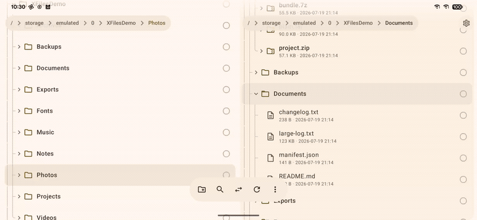

<div align="center">


# XFiles

**一款离线、开源的 Android 文件管理器，沿用 X-plore 的操作方式** —— 双栏树形浏览、
压缩包当文件夹逛、应用管理、root 访问 —— 跑在最新的 Android 技术栈上，
界面采用 Material 3 Expressive。

[](https://github.com/Local1stDotApp/XFiles/releases)
[](LICENSE)
[-3DDC84?logo=android&logoColor=white)](#构建与运行)
[](#技术栈)
[](#权限与隐私)

[English](README.md) · 简体中文



<sub>真机录制（OnePlus 7 Pro，Android 16）。在一栏选中 → <b>Copy to…</b> → 另一栏就是默认的目标目录。</sub>

</div>

---

## 缘起

- 过去半年 **X-plore 在 [Waydroid](https://waydro.id) 上用不了了**，得找个替代品。
- **现在是 LLM 时代** —— 工具不趁手，那就自己写一个。
- **能动 root 的软件，就该开源、彻底离线、什么都不收集。**
  XFiles 没有 `INTERNET` 权限，也没有任何统计埋点。

## 下载

到 [**Releases**](https://github.com/Local1stDotApp/XFiles/releases) 拿 APK：

- **`vX.Y`** —— 稳定版，每次手动提升 `versionName` 时发布。
- **`nightly`** —— 一个滚动更新的预发布，`main` 每次推送都会刷新它。

需要 **Android 8.0（API 26）** 及以上。首次启动请授予"所有文件访问权限"
（App 会直接跳转到系统设置页）。也可以[自己编译](#构建与运行)。

## 功能

### 双栏树形浏览

X-plore 的招牌：两栏互不干扰 —— 宽屏左右并排，手机上是可滑动切换的分页。
文件夹**原地展开**成树，带缩进引导线，每一栏各自有一个悬浮的面包屑胶囊。

压缩包在树里跟普通文件夹没两样 —— 面包屑会直接钻进 `project.zip` 里去。

### 树里直接出缩略图

图片和视频首帧就地渲染。视频帧只按缩略图尺寸抽取一次并落盘缓存，重启后立即可见；
加载过程中会先显示图标占位，视频还会叠一个播放角标。

### 文件操作

通过右侧边缘的勾选圈多选。**复制/移动/解压都要选一个明确的目标目录** ——
在全屏的文件夹选择器里挑，默认就是另一栏，但你可以随便翻、也可以现场新建文件夹；
长按菜单里的 `Copy to…` / `Move to…` 同理。此外还有删除、重命名、新建文件夹。

这些都跑在后台引擎上，带进度（Expressive 的波浪进度条）、可取消，
冲突时可选 跳过 / 覆盖 / 两个都留。

### 高性能 zip

打包时用所有 CPU 核心并行压缩每个条目（commons-compress 的
`ParallelScatterZipCreator`，已压缩过的媒体文件直接 STORE）。
解压时每个 worker 各持一个 `ZipFile` 句柄，从共享队列里取活。
已防 Zip-Slip；临时空间不够时自动退回单线程流式处理。

### 前台服务

耗时的复制/移动/压缩/解压在 App 退到后台后继续跑，常驻通知里带取消按钮，
并持有 wake lock。空闲时服务自行停止。

### 压缩包当文件夹

zip/jar/apk、7z、tar(.gz/.bz2/.xz)、rar 都能只读浏览；想解压就复制出来；
APK 有安装快捷入口。

### 应用管理

已安装和系统应用分成两大类，带真实图标、版本号/包名标签和详细信息。
支持安装、启动、卸载，或者把 APK 复制出来当文件分享。

展开一个应用，属于它的东西就都在这儿了：一个 **Components** 节点，
按 activity / provider / receiver / service 分好类；外加 `base.apk` 和每个
`split_config.*` APK —— 每个都能继续展开，毕竟 APK 本来就是个 zip。

再往下点开某一类，每个组件都会显示类名和它在 manifest 里的真实状态 ——
`exported` / `not exported`、`enabled` / `disabled`。
可以启动 activity、创建快捷方式，系统允许的话还能启用/禁用组件。

### Root 访问

默认关闭。在设置里打开 **Root access**，存储根列表里就会多出一个 **Root**（`/`）入口 ——
旁边还有个独立的 **Read-only** 开关，会挡掉所有需要 root 权限的写操作，
让你能进去看，但没法把系统搞坏。

打开之后看到的是真实的文件系统 —— `/data` 展开后是 `adb`、`anr`、`app`、
`app-private`、`dalvik-cache`，这些目录普通应用连列出来都做不到。
XFiles 通过 `su` 以超级用户身份浏览它：在 `/data`、`/system` 等目录下
list/read/write/mkdir/rename/delete。
文件通过 `su cat` / `cat >` 流式读写，所以 App 自带的查看器也能打开受保护的文件。
拿不到 `su` 时退化为只读的 `/` 视图。

设置页里还有其余的偏好项 —— 主题、动态取色、显示隐藏文件、文件夹优先、排序字段和升降序。

### 查看器

图片查看器（分页 + 双指缩放）、可编辑保存的文本查看器、按需分页的十六进制查看器、
音频播放器，以及一个自研的视频播放器（Media3/ExoPlayer），支持**逐帧精确定位**。

点一下时间读数，它就变成帧计数器 —— 当前帧、总帧数和真实帧率 —— 然后可以 ±1 帧步进；
在画面上滑动可按时间或按帧拖动并实时预览；那张紧凑的控制卡片可以拖走；也能全屏沉浸播放。

### 搜索

流式实时递归搜索，支持 `*` / `?` 通配符。会钻进压缩包里找，点结果可在树中定位。

### Material 3 Expressive

`MaterialExpressiveTheme` + expressive 动效、动态取色（Android 12+）、
浅色/深色/跟随系统、悬浮工具栏、`LoadingIndicator` / `LinearWavyProgressIndicator`。
真正的边到边：没有顶部 app bar —— 内容从状态栏底下滚过去，上面盖一层渐变蒙版，
只留悬浮的面包屑和设置按钮。

## 权限与隐私

没有网络权限，没有埋点，没有账号，没有广告。App 声明的每一个权限及其用途：

| 权限 | 用途 |
|---|---|
| `MANAGE_EXTERNAL_STORAGE` | 浏览和修改整个共享存储 —— X-plore 这类管理器的立身之本 |
| `READ_EXTERNAL_STORAGE`（≤ API 32） | 老版本 Android 上的读取路径 |
| `WRITE_EXTERNAL_STORAGE`（≤ API 29） | 老版本 Android 上的写入路径 |
| `QUERY_ALL_PACKAGES` | 应用管理要列出已安装的应用 |
| `REQUEST_DELETE_PACKAGES` | 在应用管理里卸载 |
| `REQUEST_INSTALL_PACKAGES` | 安装你复制出来的 APK，包括 split `.apks` |
| `POST_NOTIFICATIONS` | 长任务的进度通知 |
| `FOREGROUND_SERVICE`、`FOREGROUND_SERVICE_DATA_SYNC` | 退到后台后让复制/移动继续跑 |
| `WAKE_LOCK` | 任务进行中别休眠 |
| **`INTERNET`** | **没有申请。** App 根本没法访问网络 |

最后一行是操作系统层面的强制约束，不是口头承诺 —— 你可以自己去
[`AndroidManifest.xml`](app/src/main/AndroidManifest.xml) 里看，
或者对 APK 跑一下 `aapt dump permissions` 验证。

## 技术栈

| 层 | 选型 |
|---|---|
| 语言 / UI | Kotlin、Jetpack Compose（BOM 2026.06.01）、material3 **1.5.0-alpha23**（Expressive API） |
| 构建 | AGP 9.2.1（内置 Kotlin，不用 KGP）、Gradle 9.4.1、compileSdk 37 / target 37 / min 26 |
| 架构 | 单模块，MVVM + StateFlow，手写 DI 组合根（`di/Graph`） |
| 持久化 | DataStore Preferences |
| 媒体 / 图片 | Coil 3（GIF，自定义 fetcher：应用图标、落盘缓存的视频缩略图）、Media3 ExoPlayer |
| 压缩包 | java.util.zip、commons-compress（+xz）、junrar |

注：material3 锁在 `1.5.0-alpha23`，因为 1.4.0 正式版里 Expressive 那批 API 还是 `internal`。

## 项目结构

```
app/src/main/java/app/local1st/files/
├── core/
│   ├── fs/        XEntry 模型、XId id 方案、XFileSystem + FsRegistry、
│   │              Local/Archive/Apps/Root 文件系统、RootShell (su)、存储根
│   ├── ops/       OperationEngine（复制/移动/删除/压缩 + 冲突处理）
│   ├── search/    递归 SearchEngine
│   ├── prefs/     DataStore 设置
│   ├── thumb/     Coil fetcher：应用图标、落盘缓存的视频缩略图
│   └── util/      格式化、mime/类别映射、intent、APK 安装/解析
├── di/            Graph（组合根）+ GraphInit 装配
└── ui/
    ├── browser/   PaneController（树状态机）、PaneView、EntryRow
    ├── main/      MainViewModel、MainScreen（双栏 + 悬浮工具栏）、PermissionGate
    ├── dialogs/   重命名/新建文件夹/删除/压缩/详情、操作进度 + 冲突
    ├── viewer/    图片 / 文本 / 十六进制查看器、音频播放器、逐帧视频播放器
    ├── search/    搜索浮层
    ├── settings/  设置页
    ├── appinfo/   应用详情浮层
    └── theme/     MaterialExpressiveTheme 配置
```

条目 id 是类 URI 的字符串：`file:///abs/path`、
`zip:///abs/archive.zip!/inner/path`、`apps://package.name`、`root:///abs/path`。

## 构建与运行

```bash
./gradlew :app:assembleDebug
adb install -r app/build/outputs/apk/debug/app-debug.apk
```

需要 JDK 17+ 和装了 platform 37 的 Android SDK。
首次启动请授予"所有文件访问权限"（App 会直接跳到系统设置页）。

## 发布

一个**自建 runner** 上的 GitHub Actions 工作流
（[`.github/workflows/release.yml`](.github/workflows/release.yml)）在每次推送到 `main` 时构建签名 APK：

- 构建号（`versionCode`）每次运行自增（`github.run_number`）。
- `versionName` 写在 `version.properties` 里。只要它没变，每次推送就只刷新那个滚动的
  **`nightly`** 预发布；提升 `versionName` 才会切出新的稳定版 `vX.Y`。
- 签名密钥和口令来自仓库 secrets：`KEYSTORE_BASE64`、`KEYSTORE_PASSWORD`、
  `KEY_ALIAS`、`KEY_PASSWORD`。runner 上需要装 Android SDK。

## 许可证

[GPL-3.0-only](LICENSE)。一个能被交到 root 手里的文件管理器，
理应用一个能让后续所有副本都保持开放的许可证 —— 你要是发布改过的 XFiles，请连源码一起发。

---

*这是一个受 X-plore File Manager 启发的学习/仿写项目，不含原作的任何代码或素材。*
